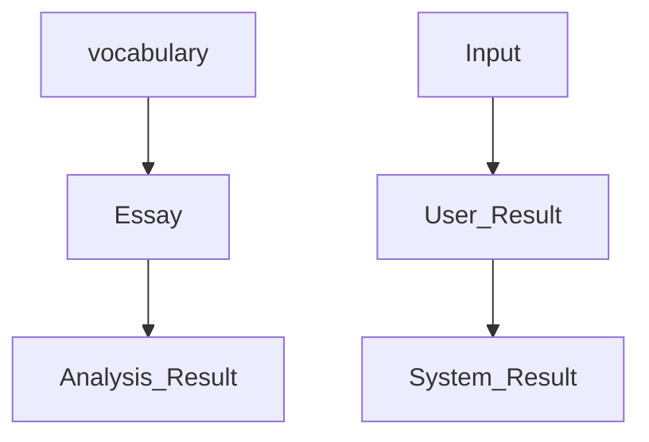

# Project Moogeul

- Youtube Link[https://www.youtube.com/watch?v=AZV8ilgvDL0]
- Huggingface Space[https://huggingface.co/spaces/seriouspark/project-moogeul?logs=build]

## 서비스 요약
글쓰기 소재를 제안해주는 챗봇. 입력된 글 속 감성을 분석하여 결과물로 제공하는 서비스
Suggest writing topic and report sentimental analysis from user's writings. 

### 목적

- 글에 내포된 감정을 추출하고 그 감정을 통해 되돌아 볼 수 있는 서비스 생성
- 자연어 처리와 관련된 여러가지 태스크를 경험하고, 그 중 해당 서비스에 적용할 수 있는 부분을 적용

### 기능

- 글을 쓰고 싶어하는 사람들에게 글을 작성할 수 있는 공간을 제공
- 에세이 한편이 완료되면, 작성자의 감정을 분석하고 그 감정과 관련된 단어 통계를 제공

### 기대효과

- 사용자는 자기 자신의 단어 사용 행태를 파악할 수 있다
- 저자 별 단어-감정 사용 행태 비교를 통해 특징을 찾아낼 수 있다

## 서비스 구조

### 프로세스

| 내용 | 필요 데이터셋 | 필요 모델링 | 기타 필요항목 |
| --- | --- | --- | --- |
| 1. 단어 입력 시 에세이 1편을 쓸 수 있는 ‘글쓰기’ 공간 제공 | 네이버 한국어 사전 | - | gradio 대시보드 |
| 2. 에세이 내 문장 분류 | 한국어 감정분석 자료 58000여건 | xlm-roberta | - |
| 3. 문장 별 감정 라벨 반환 | 한국어 감정분석 자료 58000여건 + 라벨 단순화 (60개 → 6개) | Bert Classifier |  |
| 4. 문장 내 명사, 형용사를 konlpy 활용하여 추출 | 한국어 감정분석 자료 58000여건 | konlpy Kkma | huggingface - pos tagger 검토 |
| 5. 명사, 형용사와 감정 라벨을 pair 로 만들어 빈도 집계 | - | - | - |
| 6. 해당 빈도 기반의 리뷰 제공 (저자 & 에세이리스트 수집) | yest24 칼럼 수집 
(은유, 정이현, 듀나, 총     건) | - | selenium / request / BeutifulSoup |